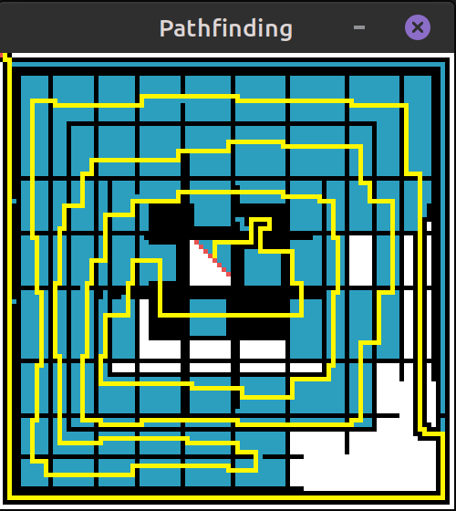

# Pathfinder

> ***Image Analysis, 2D Traversal, Pathfinding***

***TL;DR;*** - generates a path between two points, given a colored image with dark-blue as the start and green as the end (exact rgb values within program)

	

(Demonstration of a path being found when given a user-drawn map)

- Inspired by AI pathfinding algorithms, this program uses `pygame` to mark a path on a grid drawn with black and white pixels for the wall and air, and dark blue and green pixels, for the start and finish, respectively.
- This program does not use any efficient algorithm, and was instead my attempt at my own algorithm. Large grids take longer to process, but eventually a path will be denoted in yellow.
- While the program "thinks", blue cells will be drawn for points previously traversed, and red cells will be drawn for points currently being traversed.

### Required Libraries:

- pygame

- random

- sys  

